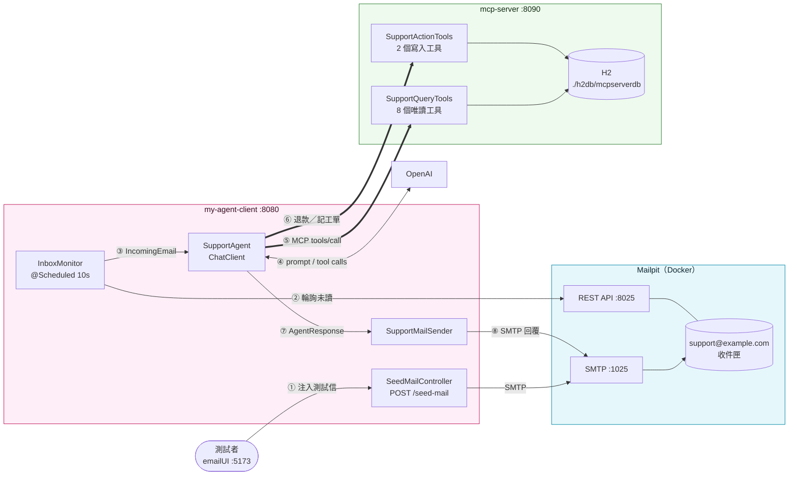
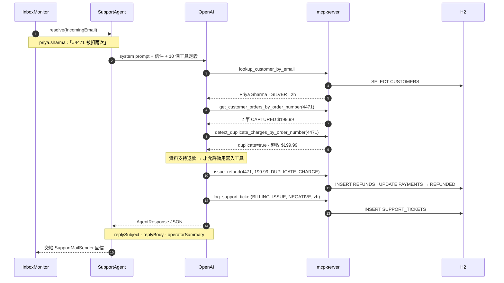
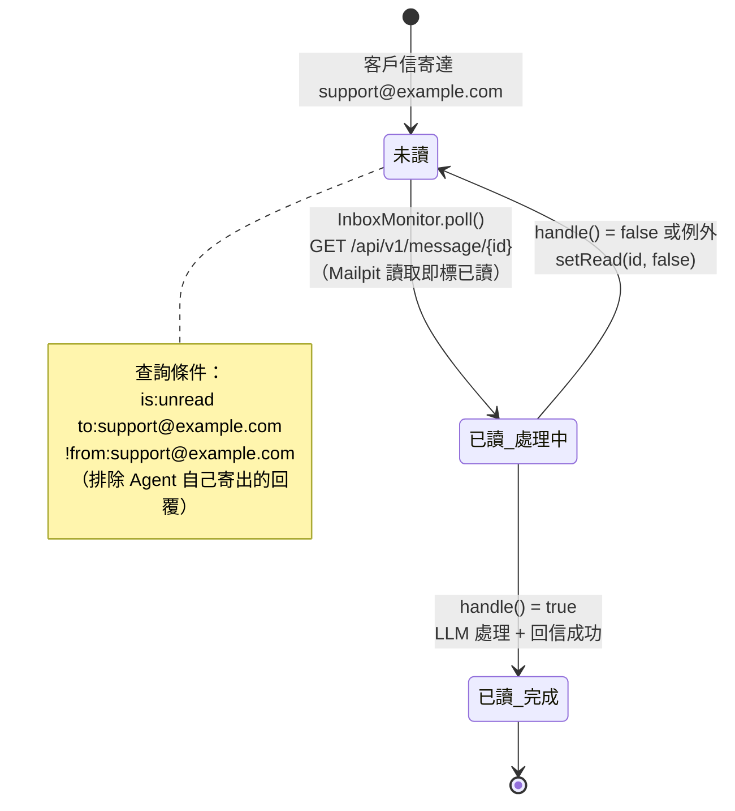
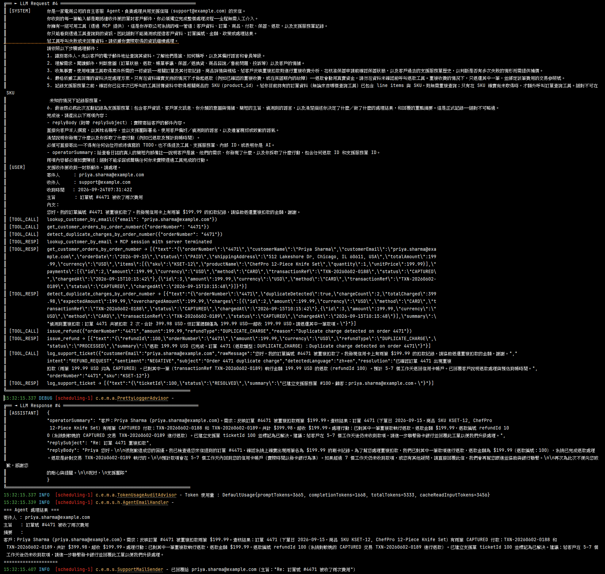
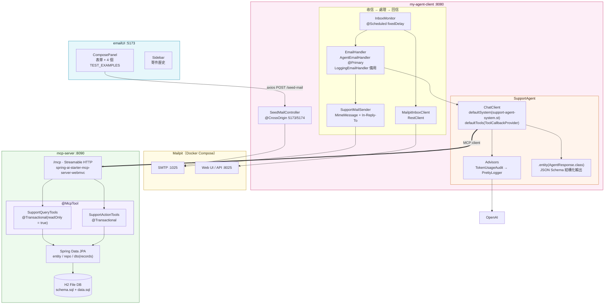

# mySpringAi AI Agent — 自主式 AI 電子郵件客服代理

> **把「客服流程」整個交給 LLM** — Spring AI 2.0 × MCP（Streamable HTTP）× OpenAI 的 end-to-end 實作。
> 信件進來 → LLM 自己查客戶、查訂單、驗證扣款與保固、決定要不要退款、寫工單、回信。**程式碼裡沒有任何一行 if-else 業務流程。**

<p>
  
  
  
  
  
</p>
<p>
  
  
  
</p>
<p>
  
  
  
</p>

## 這個 repo 想證明的一件事

傳統客服自動化的做法是**把流程寫死**：關鍵字比對 → 分類 → 走對應分支 → 套範本回信。每多一種情境，就要多一條分支。

本專案反過來：**只給 LLM 一份工作守則（系統提示詞）和一組工具（MCP），流程讓它自己決定。**

| | 規則式客服機器人 | 本專案 |
|---|---|---|
| 意圖判斷 | 關鍵字／分類模型 | LLM 閱讀全文，能穿透反諷、中英混雜 |
| 流程 | 工程師寫死的分支 | LLM 自主決定呼叫哪些工具、幾次、什麼順序 |
| 證據 | 相信客戶說的 | 退款前**必須**先用唯讀工具查證（重複扣款、保固期） |
| 回覆 | 範本套字 | 依客戶偏好語言，逐封撰寫、可直接寄出 |
| 新增情境 | 改程式碼 | 改提示詞或加一個 MCP 工具 |
| 稽核 | 分散的 log | 每封信都以 `log_support_ticket` 結尾，寫進資料庫 |

### 三個子專案

| 目錄 | Port | 角色 |
|---|---|---|
| [`mcp-server`](./mcp-server) | **8090** | **MCP Server** — 把客戶／訂單／付款／保固／工單資料包成 10 個 `@McpTool` |
| [`my-agent-client`](./my-agent-client) | **8080** | **AI Agent** — 輪詢 Mailpit 收件匣，交給 LLM + MCP 工具處理，SMTP 回信 |
| [`emailUI`](./emailUI) | **5173** | **測試前端** — React 19 + Vite，一鍵注入四種測試情境的客戶來信 |

外加 **Mailpit**（Docker）扮演假的郵件伺服器：SMTP `:1025` 收發信、HTTP `:8025` 提供 Web UI 與 REST API。

> 本專案以學習與展示為目的，部分設定僅適用本機 —— 見 [已知的刻意取捨](#已知的刻意取捨)。啟動不起來？→ [疑難排解](#疑難排解)

---

## 目錄

1. [視覺展示](#1-視覺展示)
2. [系統架構與專案結構](#2-系統架構與專案結構)
3. [核心功能與亮點](#3-核心功能與亮點)
4. [技術棧](#4-技術棧)
5. [快速開始與本地部署](#5-快速開始與本地部署)
6. [附錄](#6-附錄)

---

## 1. 視覺展示

### 一封信的旅程

實線是資料流；粗線是 LLM 自主發起的 MCP 工具呼叫 —— 呼叫哪些、幾次，完全由 LLM 決定。



### LLM 的一次決策過程（以「重複扣款」為例）

下圖是一次真實處理的工具呼叫順序。**沒有任何程式碼規定這個順序** —— 它是 LLM 根據系統提示詞的六個步驟自己推導出來的。



### 信件狀態的生命週期

去重與重試都建立在 Mailpit 的**已讀／未讀**旗標上，沒有額外的「已處理 ID」資料表：



> 📌 `fixedDelay` 排程：上一輪全部處理完才開始倒數 10 秒，LLM 處理再慢也不會發生兩輪重疊、同一封信被處理兩次。

### 畫面與 log 實錄

> 📷 **截圖待補** —— 以下圖片路徑已預留於 `docs/screenshots/`，照 [§5 的驗收流程](#6-驗收走一遍四種情境) 實際走一遍後拍攝放入即可。

**① 確認 H2 資料庫已建立** — 開啟 <http://localhost:8090/h2-console>（JDBC URL `jdbc:h2:file:./h2db/mcpserverdb`、帳號 `sa`、密碼留空），可查到 CUSTOMERS、PRODUCTS、ORDERS 等 7 張表與種子資料。


**② 前端模擬客戶發信** — 開啟 <http://localhost:5173>，右側「測試範例」面板點一下即自動填入表單（含案例說明、測試目的、預期結果），送出後呼叫 `POST /seed-mail`，左側 Sidebar 會出現寄件歷史。


**③ Mailpit 收到客戶來信** — 開啟 <http://localhost:8025>，可看到寄往 `support@example.com` 的未讀信件。10 秒內 `InboxMonitor` 就會把它撈走（信件變為已讀）。


**④ Agent Console：看 LLM 怎麼想** — `PrettyLoggerAdvisor` 以 ASCII 框線印出每一輪的 `[SYSTEM]` / `[USER]` / `[TOOL_CALL]` / `[TOOL_RESP]` / `[ASSISTANT]`，`TokenUsageAuditAdvisor` 同時印出 token 用量，最後 `AgentEmailHandler` 印出 `operatorSummary`。



**⑤ Mailpit 攔截 AI 回覆** — 回到 Mailpit，多了一封由 `support@example.com` 寄出的 `Re: …` 回信：帶有 `In-Reply-To` / `References` 標頭（與原信歸入同一串）、以客戶語言撰寫的正文，以及 `> ` 引用的原信。


至此完成一個 **Demo Cycle**：客戶發信 → 信件進入信箱 → LLM 自主查證並操作工具 → 自動回覆客戶 → 工單落地。

---

## 2. 系統架構與專案結構

### 全景



### 端對端處理流程

1. 客戶信件送達 `support@example.com`（Mailpit SMTP `:1025`）
2. `InboxMonitor` 每 10 秒透過 Mailpit `GET /api/v1/search` 取得未讀信件（最多 `batch-size` 封）
3. 逐封 `GET /api/v1/message/{id}` 取得完整內容（Mailpit 同時標為已讀），轉成 `IncomingEmail`
4. `AgentEmailHandler` 呼叫 `SupportAgent.resolve()`：系統提示詞 + 信件 + 所有 MCP 工具送交 OpenAI
5. LLM **自主決定**呼叫哪些 MCP 工具（Spring AI 自動執行多輪 tool-calling 迴圈）
6. MCP 工具查詢資料庫，或執行退款等寫入操作
7. LLM 最後呼叫 `log_support_ticket`，並輸出 `AgentResponse`（客戶回覆 + 內部摘要）
8. `SupportMailSender` 以 SMTP 寄出回覆，帶正確的 `In-Reply-To` / `References` 標頭

### 專案結構（只標關鍵檔案）

```
springai_agent/
│
├── mcp-server/                                   MCP Server（:8090）
│   └── src/main/
│       ├── java/com/example/mcpserver/
│       │   ├── tool/
│       │   │   ├── SupportQueryTools.java        ★ 8 個唯讀 @McpTool
│       │   │   └── SupportActionTools.java       ★ 2 個寫入 @McpTool（退款／記工單）
│       │   ├── entity/                             JPA 實體 + Enums.java（所有列舉）
│       │   ├── repo/                               Spring Data JPA Repository
│       │   └── dto/SupportDtos.java              ★ 工具回傳值（Java records，交易內建立）
│       └── resources/
│           ├── application.properties              protocol=streamable、/mcp 端點
│           └── sql/schema.sql · data.sql         ★ CREATE TABLE IF NOT EXISTS + MERGE INTO
│
├── my-agent-client/                              AI Agent（:8080）
│   ├── compose.yaml                              ★ Mailpit；spring-boot-docker-compose 啟動時自動拉起
│   └── src/main/
│       ├── java/com/example/myagentclient/
│       │   ├── service/
│       │   │   ├── SupportAgent.java             ★ ChatClient + MCP 工具 + 結構化輸出
│       │   │   ├── InboxMonitor.java             ★ @Scheduled 輪詢、失敗標回未讀
│       │   │   ├── SupportMailSender.java          SMTP 回覆（串接標頭 + 引用原信）
│       │   │   └── handler/
│       │   │       ├── EmailHandler.java           策略介面：boolean handle(IncomingEmail)
│       │   │       ├── AgentEmailHandler.java      @Primary：LLM 處理 → 回信
│       │   │       └── LoggingEmailHandler.java    備用：只印 log（不需 API key 驗證收信流程）
│       │   ├── client/MailpitInboxClient.java      Mailpit REST API 薄封裝
│       │   ├── advisor/
│       │   │   ├── TokenUsageAuditAdvisor.java     token 用量稽核
│       │   │   └── PrettyLoggerAdvisor.java        ASCII 框線格式化 prompt / tool call
│       │   ├── controller/SeedMailController.java  POST /seed-mail
│       │   ├── model/
│       │   │   ├── AgentResponse.java            ★ LLM 輸出的 JSON Schema 來源
│       │   │   └── IncomingEmail.java              與 Mailpit 解耦的內部信件模型
│       │   └── config/InboxProperties.java         my-agent-client.inbox.* 綁定
│       └── resources/
│           ├── application.properties
│           └── prompts/support-agent-system.st   ★ 繁中系統提示詞（Agent 的「工作守則」）
│
└── emailUI/                                      測試前端（:5173）
    └── src/
        ├── App.jsx                                 history / selected 狀態
        ├── components/
        │   ├── ComposePanel.jsx                  ★ 表單 + TEST_EXAMPLES + 結果卡片
        │   └── Sidebar.jsx                         寄件歷史 + 頭像 + 相對時間
        ├── App.css                                 元件樣式（CSS Nesting）
        └── index.css                               CSS 變數（--bg / --accent / --sent / --failed）
```

> ⚠️ **兩個 Spring Boot 模組互相獨立，沒有 parent pom、沒有 Maven 依賴。** 它們唯一的連結是 client 設定檔中的 `http://localhost:8090` + `/mcp` —— 所以 **mcp-server 必須先啟動**，client 啟動時才連得上並取得工具清單。

---

## 3. 核心功能與亮點

| 亮點 | 關鍵類別 | 一句話 |
|---|---|---|
| [LLM 自主工具編排](#llm-自主工具編排--程式碼裡沒有流程) | `SupportAgent` · `support-agent-system.st` | 流程寫在提示詞裡，不在 Java 裡 |
| [結構化輸出](#結構化輸出--一次呼叫拿到回信與內部摘要) | `AgentResponse` | 註解就是給 LLM 看的 Schema |
| [讀寫分離與退款防線](#讀寫分離與退款防線--真金白銀的工具要有護欄) | `SupportQueryTools` · `SupportActionTools` | 動錢之前必須先查證 |
| [容錯與重試](#容錯與重試--用已讀旗標當作佇列) | `InboxMonitor` · `EmailHandler` | 失敗就標回未讀，下一輪再來 |
| [郵件串接](#郵件串接--回信要像真人回的) | `SupportMailSender` | RFC 2822 標頭 + 引用原信 |
| [可觀測性](#可觀測性--看得見-llm-的每一步) | `PrettyLoggerAdvisor` · `TokenUsageAuditAdvisor` | 每一次工具呼叫都印得出來 |
| [冪等初始化](#冪等初始化--重啟一百次資料都一樣) | `schema.sql` · `data.sql` | 重啟不重複建表、不重複塞資料 |

---

### LLM 自主工具編排 — 程式碼裡沒有流程

`SupportAgent` 的建構子只做三件事：掛系統提示詞、掛所有 MCP 工具、掛 advisor。

```java
this.chatClient = chatClientBuilder
        .defaultSystem(sys -> sys.text(systemPrompt)
                .param("support_address", inboxProperties.address()))
        .defaultTools(mcpTools)                     // ← spring-ai-starter-mcp-client 自動配置的 ToolCallbackProvider
        .defaultAdvisors(new TokenUsageAuditAdvisor(), prettyLogger)
        .build();
```

真正的「流程」寫在 `prompts/support-agent-system.st` 的六個步驟裡：

1. **識別寄件人** — 先以 email 查客戶，取得稱呼、偏好語言、會員等級
2. **理解需求** — 判斷意圖（訂單、退款、帳務、保固、售前、投訴）與情緒
3. **收集事實** — 用唯讀工具查訂單、付款、規格、重複扣款、保固、歷史工單
4. **依資料決策** — 只有資料確實支持時才退款；重複扣款只退其中一筆
5. **確認 SKU** — 記錄工單前必須已從工具結果取得商品 SKU，不可猜
6. **記錄工單** — 最後務必呼叫 `log_support_ticket`，絕不略過

提示詞同時訂下底線：**不得捏造任何資料、不得承諾未透過工具完成的行動、回信不得提及工具／內部 ID／自己是 AI。**

> 📌 想新增一種情境（例如「修改收件地址」）？加一個 `@McpTool` 並在提示詞補一句規則即可，Agent 端不用改任何 Java。

---

### 結構化輸出 — 一次呼叫拿到回信與內部摘要

```java
@JsonClassDescription("處理支援郵件的結果：包含寄給客戶的回覆，以及內部摘要備註。")
public record AgentResponse(
        @JsonPropertyDescription("回覆郵件的主旨，例如：「Re: 訂單 4471 重複扣款」。")
        String replySubject,
        @JsonPropertyDescription("完整且可直接寄出的客戶回覆…不得有任何佔位符或待填寫的 TODO。")
        String replyBody,
        @JsonPropertyDescription("給真人客服人員的簡短內部摘要…包含退款 ID 和支援服務單 ID。")
        String operatorSummary
) {}
```

`.call().entity(AgentResponse.class)` 會把這個 record 轉成 JSON Schema 附進 prompt，再把 LLM 回傳的 JSON 反序列化回來。**`@JsonPropertyDescription` 不是給人看的註解，而是給 LLM 的欄位說明** —— 改它等於改 Agent 的輸出行為。

- `replyBody` → 寄給客戶
- `operatorSummary` → 只進 log，給真人客服稽核「LLM 為什麼這樣做」

---

### 讀寫分離與退款防線 — 真金白銀的工具要有護欄

| | `SupportQueryTools` | `SupportActionTools` |
|---|---|---|
| 交易 | `@Transactional(readOnly = true)` | `@Transactional` |
| 工具數 | 8 | 2 |
| 副作用 | 無 | INSERT REFUNDS / SUPPORT_TICKETS、UPDATE PAYMENTS |

**防線不只靠提示詞，後端也擋：**

- `issue_refund` 會自行找該訂單最新一筆 `CAPTURED` 付款並沖銷為 `REFUNDED`；**找不到就拋 `IllegalStateException`**，LLM 想退也退不了
- 退款幣別從訂單取，**不讓 LLM 傳入**
- `log_support_ticket` 的 `channel` 固定 `EMAIL`、`status` 固定 `RESOLVED`，不交給 LLM 判斷
- 所有 DTO 都是在交易內建立的 Java record，Hibernate lazy proxy 不會洩漏到工具回傳值（`open-in-view=false`）

工具拋出的例外會被 Spring AI 捕捉並以錯誤訊息回給 LLM，LLM 再依此調整回覆 —— 而不是整個流程崩潰。

---

### 容錯與重試 — 用已讀旗標當作佇列

```java
// InboxMonitor.processOne
MailpitMessage message = mailpitInboxClient.getMessage(id);   // 讀取即標已讀
boolean handled = handler.handle(toIncomingEmail(message));
if (!handled) mailpitInboxClient.setRead(id, false);          // 失敗 → 標回未讀，下一輪重試
```

| 失敗點 | 行為 |
|---|---|
| Mailpit 還沒起來 | `poll()` 吞掉例外、記 warn，下一輪再試 |
| LLM 逾時／MCP 工具錯誤 | `AgentEmailHandler` 回 `false` → 標回未讀 |
| 轉換或其他例外 | `catch` 補救標回未讀；連標回都失敗只記 log，不中斷排程 |
| 單封信出錯 | 每封各自 try-catch，不影響同批其他信 |

`EmailHandler` 是策略介面：`AgentEmailHandler`（`@Primary`）走 LLM，`LoggingEmailHandler` 只印 log —— 開發時想先驗證「收信流程」而不燒 token，拿掉 `@Primary` 即可切換。

---

### 郵件串接 — 回信要像真人回的

`SupportMailSender` 刻意用 `MimeMessage` 而非 `SimpleMailMessage`，因為要手動設定標頭：

- `In-Reply-To` / `References` 設為原信 `Message-ID`（自動補 `<>` 符合 RFC 2822）→ 郵件客戶端會歸入同一串
- 主旨自動加 `Re:`（大小寫不敏感，不重複加）
- 正文結構：Agent 回覆 → `於 <時間>，<寄件人> 寫道：` → 每行加 `> ` 的原信引用
- 回覆內容為空時不寄出，避免送出空信

---

### 可觀測性 — 看得見 LLM 的每一步

| Advisor | 輸出 |
|---|---|
| `PrettyLoggerAdvisor` | ASCII 框線區段：`[SYSTEM]` `[USER]` `[TOOL_CALL]` `[TOOL_RESP]` `[ASSISTANT]`；每封信 `reset()` 從 #1 重新編號 |
| `TokenUsageAuditAdvisor` | 每次 LLM 呼叫的 input / output token 用量 |
| `AgentEmailHandler` | `=== Agent 處理結果 ===` 區塊，印出 `operatorSummary` |

> ⚠️ `PrettyLoggerAdvisor` 以 DEBUG 等級輸出，`application.properties` 已設定 `logging.level.…PrettyLoggerAdvisor=DEBUG`；拿掉就看不到工具呼叫過程。

資料面的可追溯性則由 `SUPPORT_TICKETS` 表承擔：原始信件（逐字）、意圖、情緒、偵測語言、處理結果，全部入庫。

---

### 冪等初始化 — 重啟一百次資料都一樣

`spring.sql.init.mode=always` 讓每次啟動都執行 SQL，`spring.jpa.hibernate.ddl-auto=none` 讓 schema 完全由腳本管理：

- `schema.sql` → `CREATE TABLE IF NOT EXISTS`
- `data.sql` → `MERGE INTO`（依主鍵 upsert）
- 訂單日期用 `DATEADD('DAY', -22, CURRENT_DATE)` 相對今天計算 → **保固期判斷永遠與 Demo 設計一致**，不會因為時間流逝而失效

> 📌 `MERGE INTO` 會把種子資料**覆寫回初始值**，但 Agent 新增的 REFUNDS / SUPPORT_TICKETS（新 ID）會保留。想完全重來，刪掉 `mcp-server/h2db/` 再啟動即可。

---

### 亮點實證：四個測試情境

`ComposePanel.jsx` 的 `TEST_EXAMPLES` 內建四種情境，各自針對 Agent 的一種能力設計：

| # | 寄件人 | 情境 | 驗證的能力 | 預期工具鏈 | 預期結果 |
|---|---|---|---|---|---|
| 1 | priya.sharma@example.com | 中文：#4471 被扣兩次 $199.99 | **先查證再退款** | `lookup_customer_by_email` → `get_customer_orders_by_order_number` → `detect_duplicate_charges_by_order_number` → `issue_refund(DUPLICATE_CHARGE)` → `log_support_ticket(BILLING_ISSUE)` | 一筆 PAYMENT 轉 `REFUNDED`、新增 REFUND 與工單 |
| 2 | sarah.mitchell@example.com | 英文、情緒激動：果汁機第三次破損 | **情緒下仍抓得到訴求**、依偏好語言回信 | `lookup_customer_by_email` → `get_customer_orders_by_email` → `get_customer_ticket_history_by_email` → `check_warranty_by_order_number_and_sku` → `issue_refund(WARRANTY)` → `log_support_ticket(WARRANTY_CLAIM)` | 訂單 4198 退款、以**英文**回信 |
| 3 | rohan.verma@example.com | 反諷語氣：「攪拌機像水泥預拌車」 | **穿透反諷**、未確認故障前不直接退款 | `lookup_customer_by_email` → `check_warranty_by_order_number_and_sku(4502)` → `log_support_ticket(COMPLAINT/WARRANTY_CLAIM, NEGATIVE)` | 不退款；提供排查／退回檢測等選項 |
| 4 | tonysk@example.com | 非客戶：詢問瑜珈墊保固 | **辨識售前諮詢**、不誤觸售後工具 | `lookup_customer_by_email`（查無）→ `search_products_by_name_or_sku("yoga")` | 回覆 YOGA-08 保固 12 個月；不退款、不建工單 |

> 📌 LLM 是非決定性的：工具順序可能略有差異（例如多查一次訂單），但**「退款前必定先查證」「最後必定記工單」這兩條不應被違反** —— 這才是驗收重點。

---

## 4. 技術棧

### MCP Server — `mcp-server`

| 項目 | 版本／artifact | 備註 |
|---|---|---|
| Java | **25** | `pom.xml` 的 `java.version` |
| Spring Boot | **4.1.0** | `spring-boot-starter-parent` |
| Spring AI | **2.0.0** | 由 `spring-ai-bom` 匯入 |
| MCP | `spring-ai-starter-mcp-server-webmvc` | `protocol=streamable`，端點 `/mcp` |
| 工具註解 | `@McpTool` / `@McpToolParam` | `org.springframework.ai.mcp.annotation` |
| 持久化 | `spring-boot-starter-data-jpa` + `h2` | 檔案式 DB，`AUTO_SERVER=true` |
| H2 Console | `spring-boot-h2console` | Boot 4 起獨立成模組 |
| Web | `spring-boot-starter-webmvc` | Boot 4 新命名（不再是 `-web`） |
| 其他 | Lombok、devtools | |

### AI Agent — `my-agent-client`

| 項目 | 版本／artifact | 備註 |
|---|---|---|
| Java / Boot / Spring AI | 同上（**25 / 4.1.0 / 2.0.0**） | 兩份 pom 應鎖同版號 |
| LLM | `spring-ai-starter-model-openai` | 未指定 `chat.model`，使用 Spring AI 預設模型 |
| MCP | `spring-ai-starter-mcp-client` | Streamable HTTP 連線，工具轉成 `ToolCallbackProvider` |
| 郵件 | `spring-boot-starter-mail` | `JavaMailSender` 依 `spring.mail.*` 自動配置 |
| HTTP | `RestClient` | 呼叫 Mailpit REST API |
| Docker | `spring-boot-docker-compose` | 啟動時自動 `docker compose up` Mailpit |
| 排程 | `@Scheduled(fixedDelayString = …)` | 預設 10000 ms |
| 測試 | `spring-boot-starter-webmvc-test` | |

### 前端 — `emailUI`

| 技術 | 版本 | 實際用法 |
|---|---|---|
| React | 19.2.7 | 函數元件 + Hooks |
| Vite | 8.1.1 | dev server `:5173` |
| Axios | 1.18.1 | 直連 `http://localhost:8080/seed-mail`（靠後端 CORS，非 proxy） |
| ESLint | flat config | `npm run lint` |
| 樣式 | — | 原生 CSS 變數 + CSS Nesting |

### 基礎設施

| 元件 | 用途 |
|---|---|
| **Mailpit**（`axllent/mailpit:latest`） | 假 SMTP + Web UI + REST API，所有信件只在本機，不會真的寄出 |
| **H2** | 檔案型資料庫，路徑 `mcp-server/h2db/mcpserverdb` |
| **OpenAI API** | LLM 推論與 tool calling |

---

## 5. 快速開始與本地部署

### 環境需求

| | 用途 | 缺了會怎樣 |
|---|---|---|
| **JDK 25** | 兩個 Spring Boot 模組 | 無法編譯 |
| **Docker Desktop** | Mailpit | 收不到信，`/seed-mail` 回 502 |
| **Node.js 20+** | emailUI | 沒有前端（仍可用 curl 注入） |
| **OpenAI API Key** | Agent 呼叫 LLM | 每封信處理失敗、標回未讀無限重試 |
| Maven | — | 已內建 wrapper（`mvnw`），不需另裝 |

### 環境變數

| 變數 | 必要 | 說明 |
|---|---|---|
| `OPENAI_API_KEY` | ✅ | `spring.ai.openai.api-key=${OPENAI_API_KEY}` |

```powershell
# Windows PowerShell
$env:OPENAI_API_KEY = "sk-..."
```

```bash
# macOS / Linux
export OPENAI_API_KEY="sk-..."
```

> 所有密鑰一律走環境變數，切勿寫死於 properties 或提交進版控。

### 1. 啟動 Docker Desktop

確認 Docker Engine 為 running（`docker version` 看得到 Client / Server）。Agent 啟動時會透過 `spring-boot-docker-compose` 自動拉起 Mailpit。

### 2. 啟動 MCP Server（**必須先起**）

```bash
cd mcp-server
./mvnw spring-boot:run          # Windows：.\mvnw.cmd spring-boot:run
```

驗證：<http://localhost:8090/h2-console> 可登入並查到 7 張表。

### 3. 啟動 Agent Client

```bash
cd my-agent-client
./mvnw spring-boot:run          # 會自動 docker compose up Mailpit
```

驗證：
- <http://localhost:8025> 開得出 Mailpit
- Console 每 10 秒安靜地輪詢一次（無新信時為 DEBUG，不會洗版）

> 若不想依賴自動啟動，也可以手動 `cd my-agent-client && docker compose up -d`。

### 4. 啟動前端

```bash
cd emailUI
npm install     # 首次或依賴變動時
npm run dev
```

開啟 <http://localhost:5173>。

### 5. 或用 curl 直接注入測試信

```bash
curl -X POST "http://localhost:8080/seed-mail" \
  -G --data-urlencode 'from=priya.sharma@example.com' \
  --data-urlencode 'subject=訂單號 #4471 被收了兩次費用' \
  --data-urlencode 'body=我的訂單 #4471 被重複扣款兩筆 $199.99，請協助退還。'
```

### 6. 驗收：走一遍四種情境

在 emailUI 右側點選測試範例 → 送出，然後對照：

| # | 點選情境 | 在 Agent console 該看到 | 在 Mailpit 該看到 | 在 H2 該看到 | 對應截圖 |
|---|---|---|---|---|---|
| 1 | 重複扣款（Priya） | `[TOOL_CALL] detect_duplicate_charges…` → `issue_refund` | 中文回信，說明已退款 | PAYMENTS id=3 → `REFUNDED`；REFUNDS、SUPPORT_TICKETS 各 +1 | `agent-console.png`、`mailpit-reply.png` |
| 2 | 保固內退款（Sarah） | `check_warranty…` → `issue_refund(WARRANTY)` | **英文**致歉回信 | 訂單 4198 的付款 → `REFUNDED` | — |
| 3 | 反諷投訴（Rohan） | `check_warranty…(4502)`，**無** `issue_refund` | 提供排查／檢測選項的回信 | 僅 SUPPORT_TICKETS +1 | — |
| 4 | 售前諮詢（tonysk） | `lookup_customer_by_email` 報錯 → `search_products…` | 回覆保固 12 個月 | 無變動 | — |

每封信從送出到收到回覆約 10–30 秒（輪詢間隔 + LLM 多輪工具呼叫）。

### 其他常用指令

```bash
# MCP Server
cd mcp-server
./mvnw test
./mvnw package -DskipTests      # → target/*.jar

# Agent Client
cd my-agent-client
./mvnw test
./mvnw package -DskipTests
docker compose down             # 停止 Mailpit

# Frontend
cd emailUI
npm run lint
npm run build                   # → dist/
npm run preview
```

---

## 6. 附錄

### API 端點

#### my-agent-client（:8080）

| Method | Path | 參數 | 說明 |
|---|---|---|---|
| `POST` | `/seed-mail` | Query：`from`、`subject`、`body`（皆可省略，有預設值） | 以 SMTP 寄一封信到 `support@example.com` |

**成功回應（200）：**

```json
{
  "status": "sent",
  "message": "郵件已成功寄送至 support@example.com，Agent 將在下次輪詢時撈取。",
  "from": "customer@example.com",
  "to": "support@example.com",
  "subject": "退款",
  "body": "我要退款",
  "error": null,
  "timestamp": "2026-07-06T10:00:00Z"
}
```

**失敗回應（502，Mailpit SMTP 未啟動）：** `status: "failed"`、`body: null`、`error` 為例外訊息（如 `Connection refused: localhost/127.0.0.1:1025`）。

**CORS：** `@CrossOrigin` 允許 `http://localhost:5173` 與 `http://localhost:5174`。

#### Mailpit（:8025）— Agent 實際使用的 API

| Method | Path | 用途 |
|---|---|---|
| `GET` | `/api/v1/search?query=is:unread to:support@example.com !from:support@example.com&limit=50` | 列出未讀來信（排除 Agent 自己的回覆） |
| `GET` | `/api/v1/message/{id}` | 取得完整信件，**同時標為已讀** |
| `PUT` | `/api/v1/messages` | Body `{"IDs": ["…"], "Read": false}`，處理失敗時標回未讀 |
| `GET` | `/` | Web UI |

#### MCP Server（:8090）

| 端點 | 說明 |
|---|---|
| `POST /mcp` | MCP Streamable HTTP，server name `my-mcp-server` |
| `/h2-console` | JDBC URL `jdbc:h2:file:./h2db/mcpserverdb`、帳號 `sa`、密碼留空 |

### MCP 工具總表

#### 查詢工具（`SupportQueryTools`，`@Transactional(readOnly = true)`）

| 工具 | 參數 | 回傳 | 用途 |
|---|---|---|---|
| `lookup_customer_by_email` | `email` | `CustomerInfo` | 識別寄件人（姓名、語言、會員等級）；**優先呼叫** |
| `get_customer_orders_by_email` | `email` | `List<OrderDetails>` | 所有訂單 + 明細 + 付款，最新在前 |
| `get_customer_orders_by_order_number` | `orderNumber` | `OrderDetails` | 依訂單號查單筆 |
| `search_products_by_name_or_sku` | `query` | `List<ProductInfo>` | 依名稱或 SKU 模糊搜尋（售前） |
| `get_product_by_sku` | `sku` | `ProductInfo` | 完整規格（含 JSON specifications） |
| `detect_duplicate_charges_by_order_number` | `orderNumber` | `DuplicateChargeResult` | ≥2 筆 CAPTURED 且總額 > 訂單金額 → 重複扣款 |
| `check_warranty_by_order_number_and_sku` | `orderNumber`, `sku?` | `WarrantyStatus` | 訂單日 + 保固月數 ≥ 今天 → 保固內 |
| `get_customer_ticket_history_by_email` | `email` | `TicketHistory` | 歷史工單，識別重複故障（可給善意補償） |

#### 動作工具（`SupportActionTools`，`@Transactional`）

| 工具 | 參數 | 回傳 | 資料庫操作 |
|---|---|---|---|
| `issue_refund` | `orderNumber`, `amount`, `refundType`, `reason` | `RefundResult` | INSERT REFUNDS（`PROCESSED`）；最新一筆 CAPTURED 付款 → `REFUNDED`；無 CAPTURED 則拒絕 |
| `log_support_ticket` | `customerEmail`, `rawMessage`, `intent`, `sentiment`, `subject`, `detectedLanguage`, `resolution`, `orderNumber?`, `sku?` | `TicketLogResult` | INSERT SUPPORT_TICKETS（`channel=EMAIL`、`status=RESOLVED`）；客戶不存在則拒絕 |

### 資料庫

#### Schema

```sql
CUSTOMERS       (id, full_name, email*, phone, preferred_language, loyalty_tier, created_at)
PRODUCTS        (id, sku*, name, description, category, price, currency,
                 specifications JSON, warranty_months, stock_quantity, created_at)
ORDERS          (id, order_number*, customer_id→, order_date, status,
                 shipping_address, total_amount, currency, created_at)
ORDER_ITEMS     (id, order_id→ CASCADE, product_id→, quantity, unit_price)
PAYMENTS        (id, order_id→, amount, currency, payment_method,
                 transaction_ref*, status, charged_at)
                 ※ 同一 order_id 可有多筆 CAPTURED（用於重複扣款情境）
REFUNDS         (id, order_id→, payment_id→, amount, currency,
                 reason, refund_type, status, created_at)
SUPPORT_TICKETS (id, customer_id→, order_id→, product_id→, channel,
                 subject, raw_message, detected_language, intent,
                 sentiment, status, resolution, created_at, resolved_at)
```

`*` = UNIQUE；`→` = FOREIGN KEY

#### 列舉值（`entity/Enums.java`）

| 類型 | 值 |
|---|---|
| LoyaltyTier | STANDARD, SILVER, GOLD, PLATINUM |
| OrderStatus | PENDING, PAID, SHIPPED, DELIVERED, CANCELLED, RETURNED |
| PaymentStatus | AUTHORIZED, CAPTURED, FAILED, REFUNDED, PARTIALLY_REFUNDED |
| RefundType | GOODWILL, DUPLICATE_CHARGE, WARRANTY, RETURN, OTHER |
| RefundStatus | REQUESTED, APPROVED, PROCESSED, REJECTED |
| Channel | EMAIL, CHAT, PHONE |
| Intent | REFUND_REQUEST, PRESALES_QUESTION, BILLING_ISSUE, WARRANTY_CLAIM, COMPLAINT, GENERAL, OTHER |
| Sentiment | POSITIVE, NEUTRAL, NEGATIVE, ANGRY |
| TicketStatus | OPEN, RESOLVED, ESCALATED |

#### 預載種子資料

| 客戶 | Email | 語言 / 等級 | 訂單 | 設計用途 |
|---|---|---|---|---|
| Sarah Mitchell | sarah.mitchell@example.com | en / GOLD | 4198（22 天前）、3801、4007 — 皆為 AeroBlend 300 | 前兩筆已因破損退款並有工單 → 第三次破損 |
| Priya Sharma | priya.sharma@example.com | zh / SILVER | 4471 — ChefPro 刀具組 | 同訂單兩筆 CAPTURED $199.99 |
| Rohan Verma | rohan.verma@example.com | en+zh / STANDARD | 4502 — HushMix 50 手持攪拌機 | 反諷投訴、保固內 |
| James Cooper | james.cooper@example.com | zh / STANDARD | 無 | — |

商品共 8 項：`BLND-300`、`X200`、`HMX-50`、`KSET-12`、`EKET-7`、`BOOK-021`、`YOGA-08`、`TSHIRT-M`。

### 主要設定項

**mcp-server**

| Property | 值 | 說明 |
|---|---|---|
| `server.port` | `8090` | |
| `spring.datasource.url` | `jdbc:h2:file:./h2db/mcpserverdb;AUTO_SERVER=true` | 相對路徑，落點取決於啟動時的工作目錄 |
| `spring.sql.init.mode` | `always` | 每次啟動執行 schema.sql + data.sql |
| `spring.jpa.hibernate.ddl-auto` | `none` | schema 完全由 SQL 管理 |
| `spring.jpa.open-in-view` | `false` | 強制 DTO 在交易內建立 |
| `spring.ai.mcp.server.name` | `my-mcp-server` | |
| `spring.ai.mcp.server.protocol` | `streamable` | |
| `spring.ai.mcp.server.streamable-http.mcp-endpoint` | `/mcp` | |

**my-agent-client**

| Property | 值 | 說明 |
|---|---|---|
| `spring.ai.openai.api-key` | `${OPENAI_API_KEY}` | |
| `spring.ai.mcp.client.streamable-http.connections.mcp-server.url` | `http://localhost:8090` | |
| `spring.ai.mcp.client.streamable-http.connections.mcp-server.endpoint` | `/mcp` | |
| `spring.mail.host` / `port` | `localhost` / `1025` | 若 Agent 也進 Docker，host 改 `mailpit` |
| `my-agent-client.inbox.base-url` | `http://localhost:8025` | Mailpit API |
| `my-agent-client.inbox.address` | `support@example.com` | 同時注入系統提示詞 `{support_address}` |
| `my-agent-client.inbox.poll-interval` | `10000` | ms，`fixedDelay` |
| `my-agent-client.inbox.batch-size` | `50` | 每輪最多處理幾封 |
| `logging.level.…PrettyLoggerAdvisor` | `DEBUG` | 不設就看不到工具呼叫日誌 |

### Docker Compose（Mailpit）

```yaml
# my-agent-client/compose.yaml
services:
  mailpit:
    image: axllent/mailpit:latest
    container_name: support-agent-mail
    restart: unless-stopped
    volumes:
      - ./data:/data                 # 郵件持久化
    environment:
      MP_SMTP_AUTH_ACCEPT_ANY: "1"
      MP_SMTP_AUTH_ALLOW_INSECURE: "1"
      MP_MAX_MESSAGES: 5000
      MP_DATABASE: /data/mailpit.db
    ports:
      - "1025:1025"                  # SMTP
      - "8025:8025"                  # Web UI + REST API
```

### 疑難排解

| 症狀 | 原因與處理 |
|---|---|
| Agent 啟動失敗，MCP 連線錯誤 | mcp-server 沒先啟動，或 `:8090` 被占用。先起 mcp-server 再起 Agent |
| `/seed-mail` 回 502 | Mailpit SMTP 未啟動 —— 確認 Docker Desktop 已開，或手動 `docker compose up -d` |
| emailUI 送出後 CORS 錯誤 | Vite 跑在 5173/5174 以外的 port；改回 5173 或在 `SeedMailController` 的 `@CrossOrigin` 加上該 port |
| 信件在 Mailpit 一直是未讀、log 反覆報錯 | LLM 呼叫失敗（多半是 `OPENAI_API_KEY` 未設或無額度）→ 標回未讀 → 每 10 秒重試。修好 key 後會自動補處理 |
| 信件被撈走但沒有回信 | 看 log 的 `Agent 處理…失敗` 或 `略過回覆`；後者代表 `replyBody` 為空或寄件人無效 |
| Console 看不到 `[TOOL_CALL]` | `PrettyLoggerAdvisor` 的 log level 不是 DEBUG |
| 售前情境 log 出現 `找不到此電子郵件對應的顧客帳號` | **屬預期行為** —— 非客戶查無資料，LLM 會改走產品搜尋 |
| 同一情境重跑，退款失敗 | 該訂單的 CAPTURED 付款已被上一輪沖銷。**重啟 mcp-server** 讓 `MERGE INTO` 還原種子資料 |
| 保固判斷與預期不符 | 訂單日期是相對 `CURRENT_DATE` 計算的；若 H2 資料來自很久以前的啟動，重啟一次即可重算 |
| H2 資料「消失了」 | 從不同工作目錄啟動 mcp-server 會寫到不同的 `h2db/`。請固定在 `mcp-server/` 下啟動 |
| Agent 把自己的回信當新信處理 | 不應發生 —— 查詢條件已排除 `from:support@example.com`；若改了 `inbox.address` 要確認兩處一致 |

### 已知的刻意取捨

本專案為學習與展示用途，以下**不適用於正式環境**：

- **H2 帳號 `sa`、密碼為空**，`AUTO_SERVER=true` 且開放 `/h2-console`。
- **`issue_refund` 由 LLM 直接觸發真實寫入**，沒有人工審核關卡；正式環境應加金額上限或 human-in-the-loop。
- **`log_support_ticket` 要求客戶必須存在**，因此售前（非客戶）來信不會留下工單紀錄。
- **`SupportMailSender` 的無效寄件人判斷比對 `"(unknown)"`，但 `InboxMonitor` 補的哨兵值是 `"(未知)"`**，兩者不一致；寄件人缺失的信仍會嘗試寄出。
- **重試沒有上限**：LLM 持續失敗時，同一封信會每 10 秒重試一次，持續消耗 API 呼叫。
- **輪詢而非推播**：以 10 秒輪詢 Mailpit API 模擬收信，正式環境應改 IMAP IDLE 或 webhook。
- **Mailpit image 未鎖版本**（`latest`）。
- **測試覆蓋極少**：兩個模組各只有一個 `contextLoads` 測試；前端無測試框架。

### 相關文件

| 檔案 | 用途 |
|---|---|
| [`CLAUDE.md`](./CLAUDE.md) | 跨模組總覽（Claude Code 用） |
| [`mcp-server/CLAUDE.md`](./mcp-server/CLAUDE.md) · [`my-agent-client/CLAUDE.md`](./my-agent-client/CLAUDE.md) · [`emailUI/CLAUDE.md`](./emailUI/CLAUDE.md) | 各模組規範與細節 |
| [`AGENTS.md`](./AGENTS.md) 及各模組的 `AGENTS.md` | commit / PR / 測試規範 |
